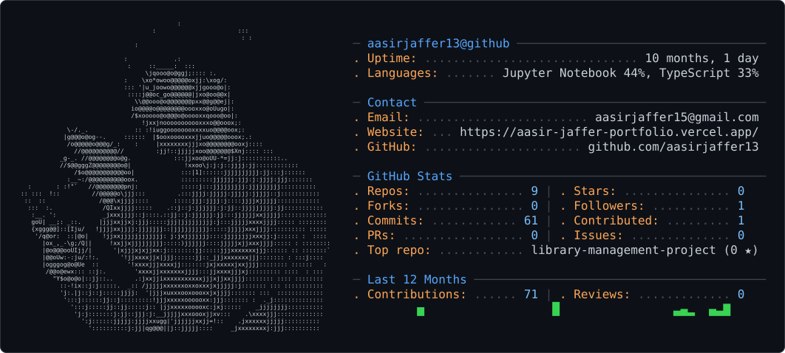

<picture>
  <source media="(prefers-color-scheme: dark)" srcset="dark_mode.svg" />
  <source media="(prefers-color-scheme: light)" srcset="light_mode.svg" />
  
</picture>

<div align="center">


<a href="https://github.com/aasirjaffer13">

</a>
<a href="https://www.linkedin.com/in/aasir-jaffer-88a826366/">

</a>
<a href="mailto:aasirjaffer15@gmail.com">

</a>

</div>

---

## Profile

I am a B.Tech student specializing in Artificial Intelligence and Machine Learning.

My current focus is on Python, machine learning, data analysis, and software development. I also work with Java and build practical projects to strengthen my programming and problem-solving skills.

```text
Primary:        Python, Machine Learning, Data Science
Programming:    Python, Java
Tools:          NumPy, Pandas, Scikit-learn, Jupyter
Focus:          Applied Machine Learning and Software Development
```

---

## Technical Skills

### Languages

<div align="center">


</div>

### Machine Learning and Data Science

<div align="center">


</div>

---

## Selected Project

### Real Estate Price Prediction

A machine learning project for estimating real estate prices using property-related features.

| Category | Technology |
|---|---|
| Language | Python |
| Machine Learning | Scikit-learn |
| Data Processing | Pandas, NumPy |
| Development | Jupyter Notebook |

<div align="center">

<a href="https://github.com/aasirjaffer13/real-estate-price-prediction-project">

</a>

</div>

[View repository](https://github.com/aasirjaffer13/real-estate-price-prediction-project)

---

## GitHub Statistics

<div align="center">


<br /><br />


</div>

---

## Contribution Activity

<div align="center">


</div>

---

## Contact

<div align="center">

<a href="https://github.com/aasirjaffer13">

</a>

<a href="https://www.linkedin.com/in/aasir-jaffer-88a826366/">

</a>

<a href="mailto:aasirjaffer15@gmail.com">

</a>

</div>

<br />

<div align="center">


</div>

